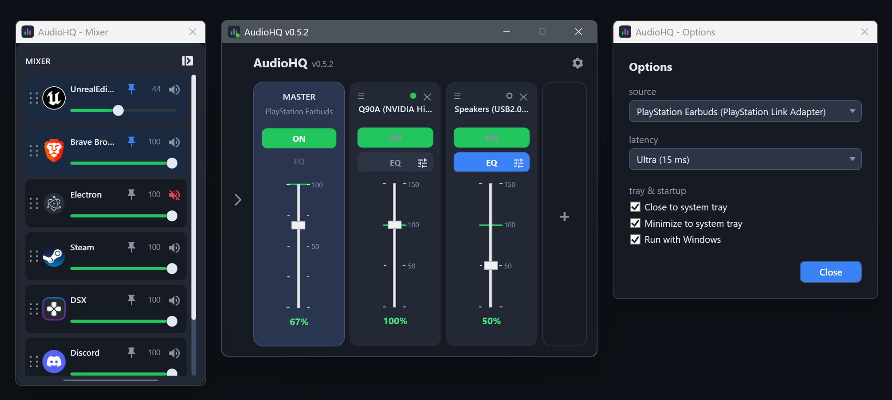

# AudioHQ

AudioHQ is a compact Windows audio router, output mixer, per-application volume
controller, and equalizer. Choose one playback device as the source and mirror its
audio to multiple outputs at once, with independent gain, mute, activation, and EQ
for every destination.

It is designed like a small desktop monitor controller: fast to operate, resilient
to device changes, and fully portable.

<p align="center">
  
</p>

> **Stack:** .NET 7, C#, WPF (hand-rolled MVVM), NAudio 2.3. Windows only.

## Why

Windows lets you play to one output device at a time. AudioHQ removes that limit:

- Play music on your desk speakers and your headphones at the same time.
- Send the same audio to a second room or a second amp.
- Keep a Bluetooth headset and a wired DAC in sync, with independent volume each.
- Control individual application volumes without opening the Windows mixer.
- Shape every mirrored output independently with graphic EQ and bass-only filtering.

## Highlights in 0.5

- A detachable application mixer that can be docked, floated, resized, hidden, and
  restored while preserving pin state and application order.
- A per-output 3-band or 6-band equalizer with adjustable Q, response visualization,
  bass-only low-pass filtering, and named presets.
- Automatic EQ preset loading, clear unsaved-state labels, one-click reset, and safe
  overwrite/delete actions.
- Coordinated desktop windows: AudioHQ, EQ, Options, and the detached mixer hide,
  restore, close, and move as one application group.
- Automatic source/device recovery, clearer status reporting, and expanded automated
  regression coverage.

## Features

- **Mirror one source to many outputs.** Capture any active render device and fan
  it out to as many other devices as you like.
- **Per-output volume.** Every output is a strip with an ON/OFF mirror toggle and
  a gain fader (0-200%, unity at 100%, colour-zoned green/amber/red). Add, remove,
  rename, reorder, and horizontally scroll larger channel sets.
- **Master strip.** Controls the Windows volume of the *source* device directly.
- **Per-output equalizer.** Open EQ from any channel for 3-band or 6-band control,
  adjustable bell width (Q), a live response curve, and an optional 12/24 dB/oct
  bass-only low-pass filter.
- **Named EQ presets.** Presets are shared across channels, load immediately when
  selected, identify unsaved edits, and support reset, overwrite, and delete actions.
- **Dockable per-app mixer.** Control the volume and mute state of applications
  currently playing on the default output. Pin and reorder apps, dock the mixer into
  AudioHQ or float it beside the main window, resize it up to ten visible rows, and
  hide/show it from the chevron rail. Layout and dock state persist across restarts.
- **Adaptive drift compensation.** Independent device clocks normally let the delay
  slowly creep until an audible re-sync jump. AudioHQ continuously nudges each
  output's resample ratio (by a fraction of a percent - inaudible) to hold the
  latency steady. It tracks the buffer's low point, so it copes even with bursty
  wireless sources that deliver audio in large chunks.
- **Latency presets.** Ultra 15 ms / Low 30 ms / Balanced 60 ms / Safe 100 ms.
- **Curated, persistent channels.** Add or remove outputs, rename them
  (double-click), and drag to reorder. Channels, gains, activation, focus, EQ,
  presets, mixer layout, and window placement are saved to `settings.json`.
- **Automatic recovery.** AudioHQ refreshes device state, recovers after resume,
  restores preferred sources when they return, and retries interrupted channels.
- **System tray.** Close or minimize to the tray, single-click the tray icon to
  hide/restore the complete AudioHQ window group, and hover it to see which outputs
  are ON and which are OFF.
- **Run with Windows.** Optional per-user startup entry.
- **Honest error states.** Exclusive-mode lock, unsupported format and unplugged
  devices each surface as a clear per-strip status instead of a crash.

## Requirements

- Windows 10 or 11
- To run: [.NET 7 Desktop Runtime](https://dotnet.microsoft.com/download/dotnet/7.0)
- To build: .NET 7 SDK

## Build and run

```
start.bat                              # kill running app, build, launch the GUI (daily driver)
dotnet build AudioHQ.sln               # build everything
dotnet test AudioHQ.sln                # run safety-net tests
dotnet run --project src/AudioHQ.Cli   # console tester: mirror to a single device
```

The runtime log is written to `audiohq.log` next to the executable
(`src/AudioHQ.App/bin/Debug/net10.0-windows/`).

## Portable release

```
powershell -ExecutionPolicy Bypass -File tools/publish.ps1
```

This produces a **self-contained, single-file** `win-x64` build (no .NET install
needed) and zips it:

```
release/
`-- AudioHQ-<version>-win-x64-portable.zip
    `-- AudioHQ-<version>-win-x64/
        `-- AudioHQ.exe          one file (~70 MB, runtime + icon embedded)
```

On first run the app creates its files **next to the exe** - it is fully portable
and keeps nothing in `%AppData%`:

```
AudioHQ-<version>-win-x64/
|-- AudioHQ.exe
|-- settings.json     source, channels, EQ, mixer layout and options
`-- audiohq.log       runtime log
```

Unzip into a user-writable folder (Desktop, Documents, a USB drive), not
`C:\Program Files` - the app writes `settings.json` / `audiohq.log` beside itself.
The exe is unsigned, so the first launch shows a Windows SmartScreen prompt
("More info" -> "Run anyway").

## How it works

```
source device --(WASAPI loopback)--> capture --> fan-out
                                                    |--> output 1: buffer -> adaptive resampler -> gain -> WASAPI render
                                                    |--> output 2: ...
                                                    `--> output N: ...
```

One capture feeds N independent pipelines. Each output owns its buffer, drift
compensator, gain and render client, so a slow or failed device can never stall
the others. See [docs/ARCHITECTURE.md](docs/ARCHITECTURE.md) for the full signal
flow, threading model and error handling.

## Project layout

```
src/AudioHQ.Core   audio engine (NAudio): capture, fan-out, per-channel gain, drift compensation
src/AudioHQ.App    WPF GUI (MVVM): mixer window, strips, tray, status, options
src/AudioHQ.Cli    console tester for the engine
tests/AudioHQ.Tests focused xUnit safety-net tests for pure logic and persisted models
docs/              technical documentation and the screenshot
tools/             helper scripts (icon generator, screenshot capture)
```

## Documentation

- **Changelog:** [CHANGELOG.md](CHANGELOG.md) - one entry per version.
- **Architecture:** [docs/ARCHITECTURE.md](docs/ARCHITECTURE.md) - technical deep dive.

The canonical version lives in `Directory.Build.props` and is shown in the window title.

## License

[MIT](LICENSE) - free to use, modify, distribute and sell, including
commercially. The only condition is keeping the copyright notice. No warranty.
